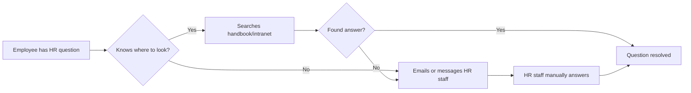
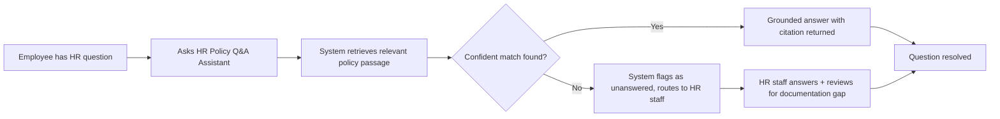

# BPMN Diagrams

## Current State: Employee Asks an HR Question (As-Is)

## Future State: Employee Asks an HR Question (To-Be)

Owner: Dineli. The future-state diagram's "flagged as unanswered" branch is the direct process source for the analytics dashboard's "unanswered questions" feature in the roadmap's Phase 4.
