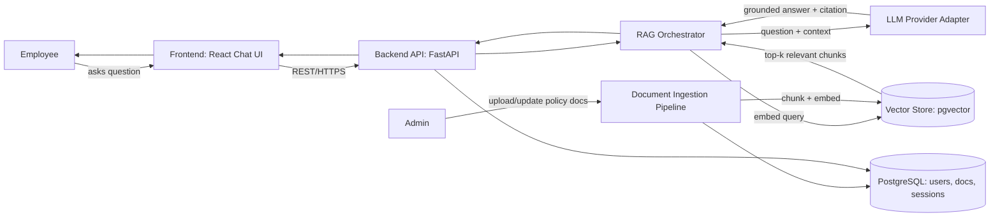

# System Architecture

## 1. High-Level Diagram

## 2. Component Responsibilities

| Component | Responsibility | Location |
|---|---|---|
| Frontend | Chat interface, displays answers with citations | `src/frontend/` |
| Backend API | Auth, request routing, orchestration entrypoint | `src/backend/` |
| RAG Orchestrator | Coordinates retrieval + generation, enforces citation requirement | `src/ai/rag/` |
| Vector Store | Stores document embeddings, performs similarity search | `src/ai/vector-store/` |
| LLM Provider Adapter | Uniform interface over interchangeable LLM providers | `src/ai/llm-providers/` |
| Prompt Management | Versioned prompt templates used by the orchestrator | `src/ai/prompt-management/` |
| Evaluation | Scores AI answers for groundedness/relevance | `src/ai/evaluation/` |
| Knowledge Base Versioning | Tracks policy document versions over time | `src/ai/knowledge-base-versioning/` |
| Document Ingestion | Chunks and embeds new/updated policy documents | `src/ai/rag/` (ingestion sub-module) |
| Database | Relational data: users, document metadata, sessions | `src/database/` |
| Analytics (future) | Usage patterns, unanswered-question tracking | `src/analytics/` |

## 3. Key Design Decisions

**Retrieval separated from generation.** The orchestrator calls the vector store and the LLM adapter as distinct steps rather than a single coupled call. This is what makes multiple LLM providers (FR-08) and an evaluation harness (Phase 3) possible without rewriting the retrieval logic — a direct requirement from the assessment brief.

**LLM access via an adapter interface, not a direct SDK call.** `src/ai/llm-providers/` defines one interface that concrete provider implementations satisfy. Swapping or adding a provider means adding one new implementation, not touching the orchestrator, frontend, or API.

**pgvector for the MVP vector store, not a dedicated vector database.** Running one database (PostgreSQL with the pgvector extension) instead of two pieces of infrastructure keeps Assessment 1–2 deployment simple. The interface in `src/ai/vector-store/` is written against an abstract "similarity search" contract so migrating to a dedicated vector database later is a swap, not a rewrite.

**Mandatory citation, not optional metadata.** Every answer returned by the orchestrator must include which retrieved chunk(s) it was grounded in (NFR-04). If retrieval confidence is too low, the system returns "I don't have a confident answer" rather than an ungrounded guess (FR-05) — this is treated as a core architectural constraint, not a UI nicety, because HR-context answers carry compliance risk if wrong.

**Analytics and multi-tenant SaaS concerns kept structurally separate from the MVP.** `src/analytics/` exists as an empty, documented folder rather than being bolted onto the backend. This keeps the Assessment 1–3 codebase focused while leaving an obvious extension point for the "future SaaS expansion" requirement.
