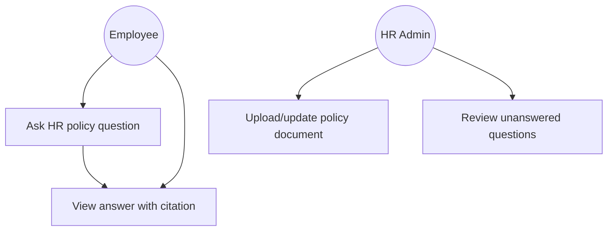

# UML Diagrams

## Use Case Diagram (initial)

Owner: Dineli. Expand with class diagrams once `src/backend/models` is scaffolded in Assessment 2, so the diagram reflects real data models rather than a speculative design.
